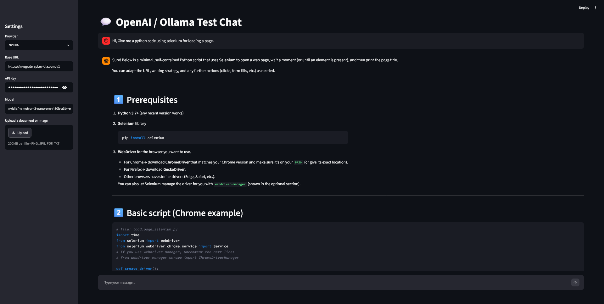

# Ry Chat (Multi-Provider LLM Chat Interface 💬)

A versatile, lightweight Streamlit web application that provides a unified chat interface for OpenAI, NVIDIA NIM, and local Ollama language models. It features real-time response streaming, image/document upload capabilities, and live performance metrics (latency and tokens per second).

## 📸 Demo

<p align="center">
  
</p>

## 🚀 Features

* **Multi-Provider Support:** Seamlessly switch between **OpenAI**, **NVIDIA NIM**, and local **Ollama** instances.
* **Dynamic Configurations:** Automatically swaps default endpoints, API key parameters, and recommended models (`gpt-5`, `qwen2.5`, etc.) based on your selection.
* **Multimodal Ready:** Supports uploading images (`png`, `jpg`, `jpeg`) and documents (`pdf`, `txt`) directly into the conversation.
* **Real-time Streaming:** Smooth, token-by-token response rendering.
* **Performance Metrics:** Tracks and preserves generation latency ($seconds$) and processing speed ($tokens/sec$) in the chat history.

---

## 📂 Project Structure

```text
├── .env                  # Your local environment secrets (ignored by git)
├── .env.example          # Template for environment variables
├── .gitignore            # Git ignore configurations
├── main.py               # Main Streamlit application source code
└── requirements.txt      # Python dependencies

```

---

## 🛠️ Setup Instructions

### 1. Clone the Repository

Navigate to your project directory containing these files.

### 2. Create a Virtual Environment & Install Dependencies

It is highly recommended to use a virtual environment to manage your dependencies.

```bash
# Create a virtual environment
python -m venv venv

# Activate the virtual environment
# On Windows (PowerShell):
.\venv\Scripts\Activate.ps1
# On macOS/Linux:
source venv/bin/activate

# Install required packages
pip install -r requirements.txt

```

> **Note:** Ensure your `requirements.txt` includes at least: `streamlit`, `openai`, `python-dotenv`.

### 3. Configure Environment Variables

Copy the provided `.env.example` file to create your local configurations:

```bash
cp .env.example .env

```

Open the newly created `.env` file and populate it with your respective API credentials:

```ini
OPENAI_API_KEY=your_openai_api_key_here
NVIDIA_API_KEY=your_nvidia_api_key_here
OLLAMA_API_KEY=ollama

```

---

## 💻 Running the Application

To launch the web interface, execute the following command in your terminal:

```bash
streamlit run main.py

```

Once running, your default browser should automatically open to `http://localhost:8501`.

---

## 💡 How to Use

1. **Select a Provider:** Use the dropdown menu in the sidebar to choose between Ollama, OpenAI, or NVIDIA.
2. **Review/Edit Endpoints:** The app will auto-fill the default Base URL and API key from your `.env` file. You can override these directly from the UI if needed.
3. **Attach Files:** Drop an image or text document into the file uploader if you want to use vision or grounding capabilities (ensure the chosen model supports multimodal inputs).
4. **Chat:** Type your prompt into the input bar at the bottom and hit Enter!
